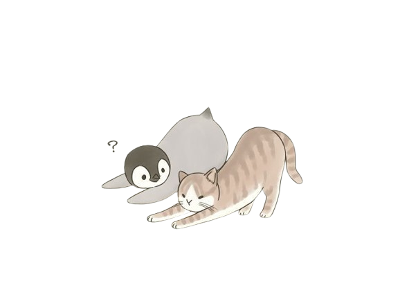
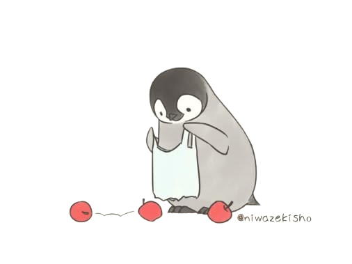

<div align="center">
  

  <h1>Anson's little corner of the internet</h1>

  <p>A minimalist software engineering portfolio—with more penguins than any reasonable design system requires.</p>

  <p><a href="https://www.ansonnchan.dev/">Visit the portfolio</a></p>
</div>

## What's on the ice?

- A quick introduction, assorted facts, and the occasional identity crisis.
- Work experience without making you read a résumé twice.
- Projects with short write-ups and demo videos.
- A contact page for humans, recruiters, and especially well-connected penguins.

The site is intentionally simple, responsive, and a little playful. It is also probably never finished. Check back after retirement.

## Under the feathers

- **Next.js 15** and **React 19**
- **TypeScript**
- Handwritten **CSS**—no component library hiding beneath the ice
- **Vercel Analytics**

## Run the colony locally

```bash
npm install
npm run dev
```

Then waddle over to [http://localhost:3000](http://localhost:3000).

For a production check:

```bash
npm run build
npm start
```

## Iceberg ahead

- [ ] Add a small writing section for everyday life, internship stories, and things I learned the hard way.
- [ ] Write short project retrospectives: what worked, what broke, and what I would do differently.
- [ ] Add a `/now` page for what I am currently building, learning, and overthinking.
- [ ] Keep improving keyboard navigation, reduced-motion support, and performance.
- [ ] Hide one tasteful penguin easter egg. Possibly two. This is how scope creep begins.

For now, I am avoiding filters, a full CMS, and other heavyweight features until there is enough content to justify them. Minimalism is mostly knowing when to stop adding fish.

<div align="center">
  

  <sub>Built with curiosity, questionable sleep schedules, and a reliable supply of penguins.</sub>
</div>
